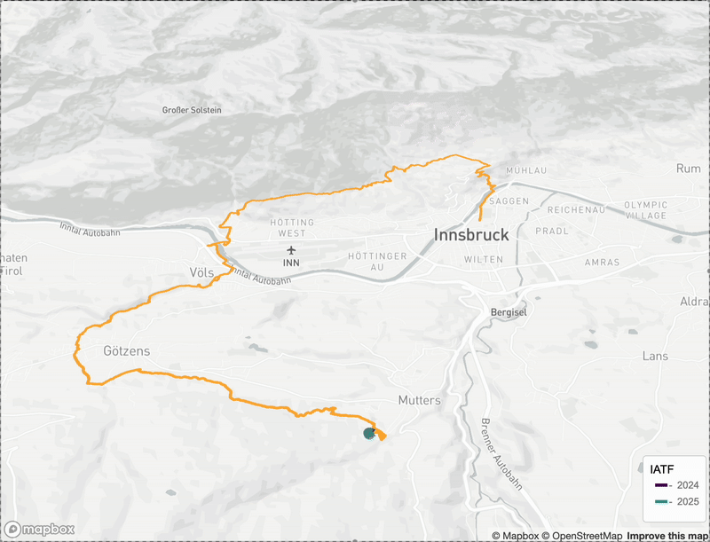

# Race Comparison: Animated GPS Plots from `.fit` Files

[](https://creativecommons.org/licenses/by-nc/4.0/)

This project visualizes and compares GPS tracks from Garmin `.fit` files in an interactive, animated map. It's built with R and integrates `mapdeck`, `sf`, and `FITfileR` for geospatial rendering.

---

## Project Structure

| Folder                  | Description                                  |
|------------------------|----------------------------------------------|
| `R/`                   | Custom R functions                           |
| `config/`              | Input parameters (YAML)                      |
| `scripts/`             | Main pipeline scripts                        |
| `data/raw/`            | Input `.fit` files (ignored by Git)          |
| `Output/`              | Final and temporary output plots             |
| `renv/`                | R environment metadata (auto-managed)        |

---

## Setup Instructions

1. Clone the repository:
   ```bash
   git clone https://github.com/knechtrs/race-comparison-fit.git
   ```
2. Open the `.Rproj` file in RStudio.
3. Install `renv` if needed:
   ```r
   install.packages("renv")
   ```
4. Restore the environment:
   ```r
   renv::restore()
   ```
5. Add your [Mapbox](https://www.mapbox.com/) token:
   ```r
   Sys.setenv(MAPBOX_TOKEN = "your_token_here")
   ```

---

## How to Use

1. Export `.fit` files from [Garmin Connect](https://connect.garmin.com/).
2. Move them into the `data/raw/` folder.
3. Configure the `config/*.yaml` file to define the activities:
   ```yaml
   fit_data:
     - file: your_fit_file.fit
       trip_id: 'Race 2025'
   ```
4. Run the main script:
   ```r
   source("scripts/race_comp_pipeline_v3.R")
   ```

---

## Output

- Animated trip overlays via `mapdeck::add_trips()`
- Interactive paths using `mapdeck::add_path()`

---

Here is an example GIF:



[View Interactive Output](https://knechtrs.github.io/fitfile-analysis/example_output.html)


## Requirements

- R ≥ 4.0
- `.fit` files
- Mapbox token
- Internet connection for map rendering

---

## License

This project is licensed under the **Creative Commons Attribution-NonCommercial 4.0 International (CC BY-NC 4.0)** license.  
You are free to use and adapt the code **for non-commercial purposes** with proper attribution.

[Full License Text](https://creativecommons.org/licenses/by-nc/4.0/legalcode)  
© 2025 Raphael Knecht

---

## Citation (Optional)

If you use this project in research or publications, please cite it as:

```
Knecht, R. (2025). Race Comparison: Animated GPS Plots from .fit Files (Version 1.0). GitHub. https://github.com/knechtrs/race-comparison-fit
```

---

## Questions or Feedback?

Open an [issue](https://github.com/knechtrs/race-comparison-fit/issues) or reach out via the repository discussion board.
